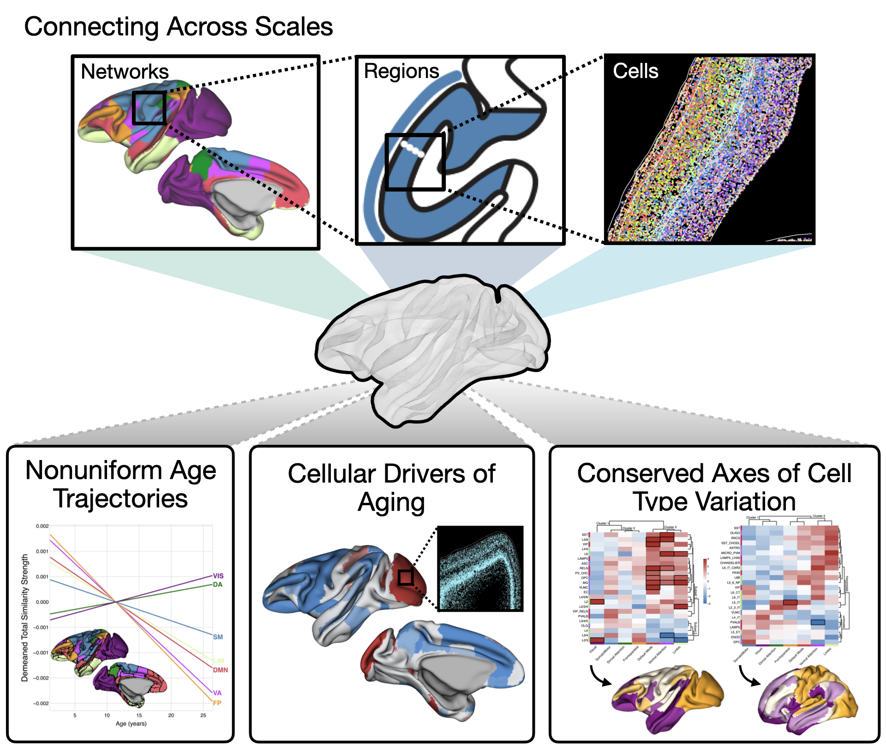

# Cellular basis for cortical network aging in primates

This repository hosts data, code, and links to external resources used to generate the results of this work.

## Publication Link

[Preprint Link](https://www.biorxiv.org/content/10.1101/2025.07.08.663725v1.full)

<p align="center">
  
</p>

---
## Supported Software Versions

### Python

This project has been tested on Python versions **3.9, 3.10, 3.11, and 3.12**. Required packages are available in [requirements.txt](./requirements.txt)

### MATLAB

The MATLAB scripts have been tested on **MATLAB R2024b** and later versions. Compatibility with earlier releases has not been verified.

### R

R code has been tested on **R 4.4.1**. 
Required R packages and tested versions:  
- `lme4` (version 1.1.35.5)  
- `lmerTest` (version 3.1.3)
  
---

## Installation Instructions
Install Time: <5 min

### Clone Github Repository
First, clone this repository to your local machine:
```bash
git clone https://github.com/micmaclab/celltype-primate-aging.git
cd celltype-primate-aging
```

### Creating a Conda Environment

To ensure compatibility and reproducibility, we recommend creating a dedicated Conda environment with one of the supported Python versions. For example, to create an environment with Python 3.12, run:

```bash
conda create --name my_env python=3.12 -y
```

### Activate the environment:

```bash
conda activate my_env
```

### Installing Required Packages

After activating the environment, install the necessary Python packages from the provided requirements.txt file:

```bash
python -m pip install -r requirements.txt
```
Note: Replace myenv with a name appropriate for your project or preference. Ensure the requirements.txt file is located in your current working directory or provide its path accordingly.

### DEMO
All files have been configured to run smoothly and reference the appropriate resources without errors. Please find cohort-level total similarity strength data ([MIND Network](./MIND_Network)) and age effect results ([Mixed Effects Models](./Mixed_Effects_Models)) in their respective directories for use in downstream analyses. Expected outputs for each analysis are also included in their corresponding folders.


---
## Alignment & Analyses 


### Project Code

- **Cortical similarity networks using Morphometric Inverse Divergence (MIND)**  
  - Usage: Compute region-wise similarity based on multivariate MRI features  
  - Code: [MIND Network: Generation](./MIND_Network/MIND_Generation.ipynb)
  - Run time: 1-2 hours

- **Computation of network-based properties**  
  - Usage: Derive total similarity strength across cortical regions and networks  
  - Code: [MIND Network: Properties](./MIND_Network/MIND_Network_Properties.ipynb)
  - Run time: <5 minutes

- **Statistical modeling of age effects**  
  - Usage: Model age-related change in regional similarity strength using `lme4`  
  - Code: [Mixed Effects Models](./Mixed_Effects_Models)
  - Run time: <5 minutes

- **3D single-cell transcriptomic atlas of macaque monkey**  
  - Usage: Analyze region- and layer-specific cell type distributions and enrichment
  - Code: [Enrichment Analysis for Macaque](./Enrichment_Analysis/macaque/enrichment_macaque.ipynb)
  - Run Time: 5-6 hours

- **Univariate associations with cell type specific abundances**  
  - Usage: Correlate regional MRI features with cell-type abundance using null models  
  - Code: [Univariate Associations](./Univariate_Associations/univariate_associations.ipynb)
  - Run Time: 5-10 minutes

- **Canonical Correlation Analysis**  
  - Usage: Identify multivariate relationships between cell profiles and MRI-based MIND.   
  - Code: [CCA Analysis](./CCA)
  - Run Time: <5 minutes

- **Human specific cortical cell type enrichment dataset**  
  - Usage: Integrate imputed human cell type distributions from Zhang et al (see *External Repositories*)
  - Code: [Enrichment Analysis for Human](./Enrichment_Analysis/human/enrichment_human.ipynb)
  - Run Time: 5-6 hours

- **Comparison of macaque and human cell types by their aligned functional networks**  
  - Usage: Test for cell type enrichment within functional networks in both species  
  - Code: [Cross Species Comparison by Network](./Cross_Species_Comparison/human_macaque_comparison.ipynb)
  - Run Time: <5 minutes

- **Macaque to human comparison of cell type composition**  
  - Usage: Compare cross-species cell type composition using PCA and Mantel test  
  - Code: [Cross Species Comparison by Composition](./Cross_Species_Comparison/human_macaque_comparison.ipynb)
  - Run Time: <5 minutes

- **Cell-cell communication analysis**  
  - Usage: Create cellchat objects for comparison of signaling across regions and whole-brain samples  
  - Code: [Cell-Cell Communication](./Cell_Cell_Communication)
  - Run Time: 2 hours
 
- **Supplementary Code**
  - Usage: code used to compare aging models and multivariate techniques in Supplementary Analyses
  - Code [Supplementary](./supplementary)
  - Run Time: <10 mins

### Project Data

- **Spatially Resolved Cell Type Distributions in Macaque Cortex - adapted from Chen et al.(2023)**
  - Cell type abundances were derived from spatial transcriptomic profiling of the macaque brain, as reported by Chen et al. The original 264 cell types were combined into their broader categories (23 cell types). These data are mapped to regions defined by the D99 macaque atlas and released in a csv file and GIfTI files per cell type. 
  - .csv: [d99_cell_abundance.csv](./data/d99_cell_abundance.csv)
  - .gii: [GIfTI Cell Type Abundances](./data/gifti/cell_abundance)

- **Yeo 7-Network Functional Parcellation Mapped to Macaque CIVET Surface - adapted from Xu et al.(2020)**
  - The 7-Network parcellation was mapped to the macaque CIVET surface through surface registration and aligned to the D99 atlas to enable unique region assignments for each functional network. These are released in both a csv and a GIfTI file. 
  - .csv: [d99_to_yeo_network_labels.csv](./data/d99_to_yeo_network_labels.csv)
  - .gii: [L.Yeo2011_7Networks_N1000.human-to-monkey.41k_civet_D99.label.gii](./data/gifti/cross-species_atlases/L.Yeo2011_7Networks_N1000.human-to-monkey.41k_civet_D99.label.gii)
 
- **Syndor Sensorimotor-Association Axis Mapped to Macaque CIVET Surface**
  - The S-A axis from Sydnor et al. (2021) was mapped to the macaque CIVET surface through surface registration (Xu et al.(2020)). The S-A axis across the left and right hemisphere are both released as GIfTI files.
  - LH: [SensorimotorAssociation_Axis_LH_CIVET_macaque.func.gii](./data/gifti/cross-species_atlases/SensorimotorAssociation_Axis_LH_CIVET_macaque.func.gii)
  - RH: [SensorimotorAssociation_Axis_RH_CIVET_macaque.func.gii](./data/gifti/cross-species_atlases/SensorimotorAssociation_Axis_RH_CIVET_macaque.func.gii)


### External Repositories

- **MIND network construction**  
  - Code: https://github.com/isebenius/MIND  
  - Reference: [Sebenius, I. et al., *Nature Neuroscience* 26, 1461–1471 (2023).](https://doi.org/10.1038/s41593-023-01376-7)

- **Functional network cross-species alignment analyses**  
  - Code: https://github.com/TingsterX/alignment_macaque-human  
  - Reference: [Xu, T. et al., *NeuroImage* 223, 117346 (2020).](https://doi.org/10.1016/j.neuroimage.2020.117346)

- **3D single-cell transcriptomic atlas of macaque monkey**  
  - [Online Visualization Tool & Data](https://macaque.digital-brain.cn/spatial-omics)  
  - Reference: [Chen, A. et al., *Cell* 186, 3743.e24 (2023).](https://doi.org/10.1016/j.cell.2023.06.009)

- **Canonical correlation analysis (CCA)**  
  - Code: https://github.com/andersonwinkler/PermCCA  
  - Reference: [Winkler, A. M., et al., *NeuroImage* 220, 117065 (2020).](https://doi.org/10.1016/j.neuroimage.2020.117065)

- **Imputed human cell type distributions**  
  - Code: https://github.com/XihanZhang/human-cellular-func-con/tree/main
  - Reference: [Zhang et al., *Nature Neuroscience* 28, 150–160 (2025).](https://doi.org/10.1038/s41593-024-01812-2)
  - See in repo: [Imputed Distributions & Related Files](./Enrichment_Analysis/human/input)

- **Surface Based Visualizations**  
  - Code: https://github.com/danjgale/surfplot

### External Tools & Software Libraries

- **CIVET-macaque**  
  - Usage: Cortical surface extraction  
  - Reference: [Lepage, C. et al., *NeuroImage* (2021)](https://doi.org/10.1016/j.neuroimage.2020.117622)
  - See in repo: [CIVET-macaque surfaces](./data/gifti/CIVET_macaque-alpha-0.2)

- **Connectome Workbench**  
  - Usage: Surface-based rendering and visualization  
  - Reference: [Marcus, D. et al., *Frontiers in Neuroinformatics* (2011)](https://doi.org/10.3389/fninf.2011.00004)

- **netneurotools**  
  - Usage: Spatial permutation tests  
  - Language: Python  
  - Code: https://netneurolab.github.io/netneurotools/

- **nibabel**  
  - Usage: Neuroimaging data handling (NIfTI, GIfTI, etc.)  
  - Language: Python  
  - Code: https://nipy.org/nibabel/

- **neuromaps**  
  - Usage: Coordinate system registration and map comparison  
  - Language: Python  
  - Code: https://netneurolab.github.io/neuromaps/
  - See in repo: [Human fsaverage surfaces](./data/gifti/fsaverage-human)
 
- **pyls**  
  - Usage: Partial Least Squares Correlation  
  - Language: Python  
  - Code: https://pyls.readthedocs.io/en/latest/
  - See in repo: [Partial Least Squares Correlation](./supplementary/plsc.ipynb)

- **lme4**  
  - Usage: Linear mixed-effects modeling  
  - Language: R  
  - Code: https://cran.r-project.org/web/packages/lme4/index.html  
  - Reference: [Bates et al., *Journal of Statistical Software* (2015)](https://doi.org/10.18637/jss.v067.i01)
 
- **CellChat**
  - Usage: Cell-cell communication analyses
  - Language: R
  - Code: https://github.com/jinworks/CellChat
  - References: [Jin et al., Nature Communications 12(1), 1088 (2021)](https://www.nature.com/articles/s41467-021-21246-9), [Jin et al., Nature Protocols 19(11), 3129–3162 (2024)](https://www.nature.com/articles/s41596-024-01045-4)


### License
Content in this repository is licensed under **CC BY-NC 4.0**.  
See the [LICENSE](./LICENSE.md) file. SPDX: `CC-BY-NC-4.0`.
